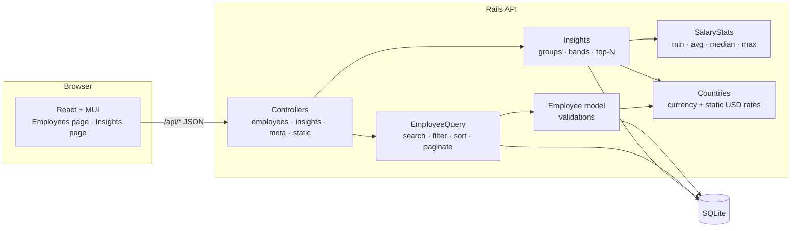
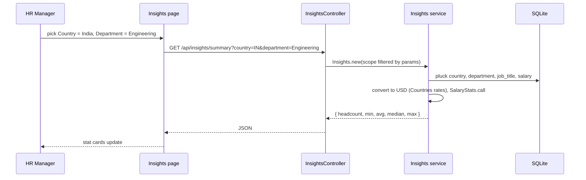
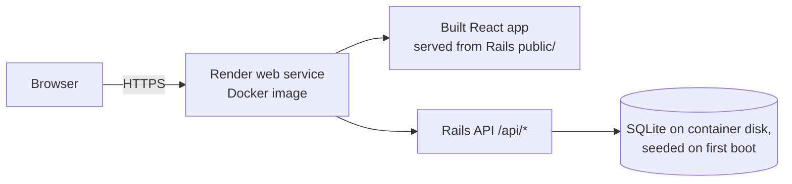

# Architecture

## Components

```mermaid
flowchart LR
  subgraph Browser
    UI[React + MUI<br/>Employees page · Insights page]
  end
  subgraph Rails API
    C[Controllers<br/>employees · insights · meta · static]
    Q[EmployeeQuery<br/>search · filter · sort · paginate]
    I[Insights<br/>groups · bands · top-N]
    S[SalaryStats<br/>min · avg · median · max]
    M[Employee model<br/>validations]
    K[Countries<br/>currency + static USD rates]
  end
  DB[(SQLite)]

  UI -- "/api/*  JSON" --> C
  C --> Q --> M
  C --> I --> S
  I --> K
  M --> K
  M --> DB
  Q --> DB
  I --> DB
```

## Request flow: "median salary of Engineering in India"

```mermaid
sequenceDiagram
  participant U as HR Manager
  participant UI as Insights page
  participant API as InsightsController
  participant INS as Insights service
  participant DB as SQLite
  U->>UI: pick Country = India, Department = Engineering
  UI->>API: GET /api/insights/summary?country=IN&department=Engineering
  API->>INS: Insights.new(scope filtered by params)
  INS->>DB: pluck country, department, job_title, salary
  INS->>INS: convert to USD (Countries rates), SalaryStats.call
  INS-->>API: { headcount, min, avg, median, max }
  API-->>UI: JSON
  UI-->>U: stat cards update
```

## Deployment

```mermaid
flowchart LR
  B[Browser] -- HTTPS --> R[Render web service<br/>Docker image]
  R --> UI[Built React app<br/>served from Rails public/]
  R --> API[Rails API /api/*]
  API --> DB[(SQLite on container disk,<br/>seeded on first boot)]
```
